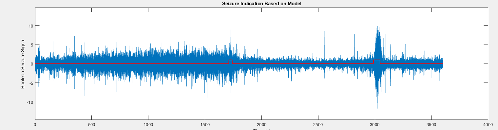
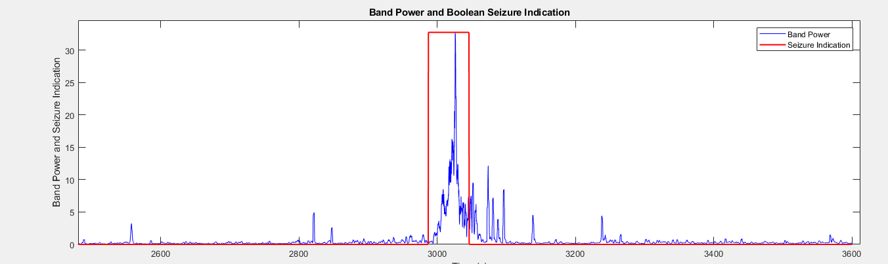
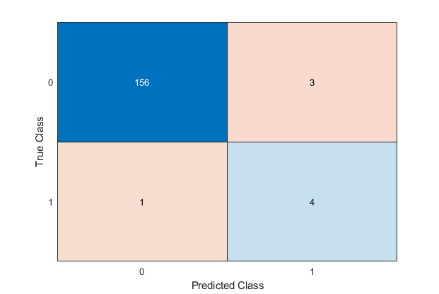

# EEG Seizure Detection with Machine Learning

## Overview

This project focuses on detecting seizures from EEG signals using advanced signal processing techniques and machine learning. The goal is to automate seizure identification, enhancing diagnostic efficiency.

## Methodology

- **Signal Processing**: Leveraged Discrete Wavelet Transform (DWT) to extract spectral features from EEG signals, highlighting critical frequency bands related to seizure activity.
- **Feature Engineering**: Developed robust features for classifying EEG segments into seizure or non-seizure states.
- **Machine Learning**: Implemented a RUSBoost classifier to handle class imbalance and achieve reliable detection.
- **Visualization**: Presented detection results through boolean overlays on EEG signals and band power graphs, showcasing the model's ability to identify seizure activity.

## Visualizations

### EEG Signal with Seizure Detection

The graph below illustrates the raw EEG signal overlaid with a boolean signal (high when seizures are detected). This boolean signal is generated by the trained machine learning model, highlighting periods of seizure activity.

### Band Power with Seizure Detection

The band power graph below shows the extracted frequency band powers over time, overlaid with a boolean signal generated by the model. This visualization provides insight into the spectral features used for seizure classification.

## Classification

### Feature Selection:
- **Standard Deviation (SD)**: Indicates the signal's variability, helping identify abrupt changes associated with seizures.
- **Band Power (BP)**: Reflects the energy in specific frequency bands, highlighting abnormal brain activity during seizures.
- **Shannon Entropy (SE)**: Measures signal randomness, useful for identifying irregular patterns typical of seizure events.
- **Log-Energy Entropy (LE)**: Quantifies signal complexity and discriminates between seizure and non-seizure states.

### RUSBoosted Tree Ensemble
- Implemented a RUSBoosted Tree Ensemble to handle class imbalance and achieve reliable real-time detection in the CHB-MIT dataset.
- Evaluated performance using metrics such as accuracy, sensitivity, false positive rate, and seizure onset detection delay.

### Results
- Accuracy: 96.38%
- Sensitivity: 96.15%
- False Positive Rate: 3.24%

## Tools and Environment
- Software: MATLAB 2019b.
- Libraries/Packages:
  - Wavelet Transform Toolbox.
  - MATLAB Classification Learner Toolbox
